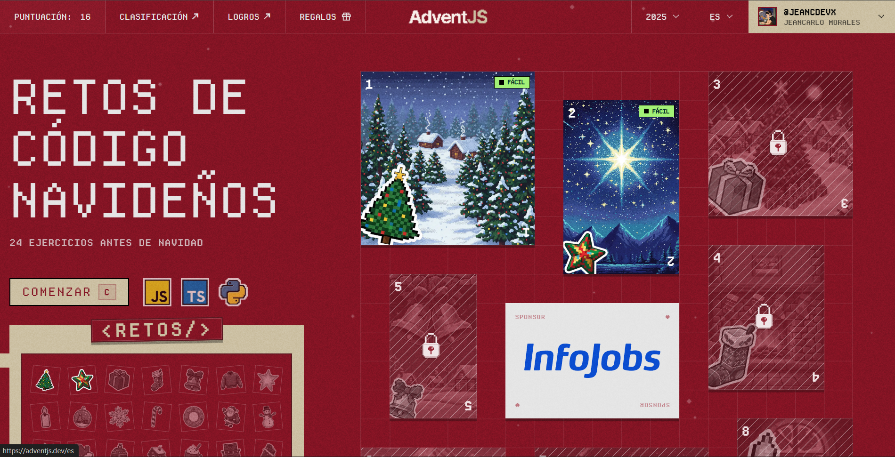
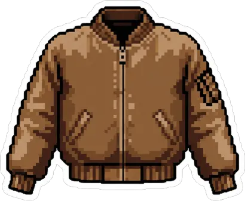
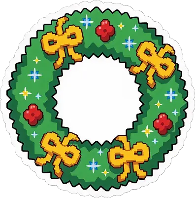

# 🎄 AdventJS 2025

<div align="center">



[](https://adventjs.dev)
[](https://www.typescriptlang.org/)
[](./README.md)

**Mis soluciones a los retos de programación de [AdventJS](https://adventjs.dev/es/) creado por [@midudev](https://github.com/midudev)**

[🎮 Participar](https://adventjs.dev) · [📺 Twitch de Midu](https://twitch.tv/midudev) · [🐦 Twitter](https://twitter.com/midudev)

</div>

---

## 📖 ¿Qué es AdventJS?

**AdventJS** es un calendario de adviento de programación creado por [midudev](https://midu.dev). Durante **25 días** (del 1 al 25 de diciembre), se publica un nuevo reto de programación con temática navideña. Los retos están diseñados para mejorar tus habilidades de lógica y programación en JavaScript/TypeScript.

## 🏆 Progreso

<div align="center">

| Retos Completados | Estrellas Obtenidas | Racha Actual |
| :---------------: | :-----------------: | :----------: |
|     **2**/25      |        ⭐⭐         |     🔥 2     |

</div>

## 📋 Lista de Retos

|  #  |                       Imagen                       | Reto                                | Dificultad |            Solución            |                        Ver Reto                        | Estado |
| :-: | :------------------------------------------------: | ----------------------------------- | :--------: | :----------------------------: | :----------------------------------------------------: | :----: |
| 01  |  | Filtrar los regalos defectuosos     |  🟢 Fácil  | [Ver](./01-challenge/index.ts) | [Ver reto](https://adventjs.dev/es/challenges/2025/1)  |   ✅   |
| 02  |  | Fabrica los juguetes                |  🟢 Fácil  | [Ver](./02-challenge/index.ts) | [Ver reto](https://adventjs.dev/es/challenges/2025/2)  |   ✅   |
| 03  |  | 👶 Ayuda al becario                 |  🟢 Fácil  | [Ver](./03-challenge/index.ts) | [Ver reto](https://adventjs.dev/es/challenges/2025/3)  |   ✅   |
| 04  |  | 🧮 Descifra el PIN de Santa         |  🟢 Fácil  | [Ver](./04-challenge/index.ts) | [Ver reto](https://adventjs.dev/es/challenges/2025/4)  |   ✅   |
| 05  |  | ⏱️ La cuenta atrás para el despegue |  🟢 Fácil  | [Ver](./05-challenge/index.ts) | [Ver reto](https://adventjs.dev/es/challenges/2025/5)  |   ✅   |
| 06  |  | 🧤 Emparejando guantes              |  🟢 Fácil  | [Ver](./06-challenge/index.ts) | [Ver reto](https://adventjs.dev/es/challenges/2025/6)  |   ✅   |
| 07  |  | 🎄 Montando el árbol                |  🟢 Fácil  | [Ver](./07-challenge/index.ts) | [Ver reto](https://adventjs.dev/es/challenges/2025/7)  |   ✅   |
| 08  |  | 🎁 Encuentra el juguete único       |  🟢 Fácil  | [Ver](./08-challenge/index.ts) | [Ver reto](https://adventjs.dev/es/challenges/2025/8)  |   ✅   |
| 09  |  | 🦌 El reno robot aspirador          |  🟢 Fácil  | [Ver](./09-challenge/index.ts) | [Ver reto](https://adventjs.dev/es/challenges/2025/9)  |   ✅   |
| 10  |  | 📨 Profundidad de la magia navideña |  🟢 Fácil  | [Ver](./10-challenge/index.ts) | [Ver reto](https://adventjs.dev/es/challenges/2025/10) |   ✅   |
| 11  |  | 📹 Regalos sin vigilancia           |  🟢 Fácil  | [Ver](./11-challenge/index.ts) | [Ver reto](https://adventjs.dev/es/challenges/2025/11) |   ✅   |
| 12  |  | ⚔️ Batalla de elfos                 |  🟡 Medio  | [Ver](./12-challenge/index.ts) | [Ver reto](https://adventjs.dev/es/challenges/2025/12) |   ✅   |
| 13  |  | 🏭 La cadena de montaje | 🟡 Medio | [Ver](./13-challenge/index.ts) | [Ver reto](https://adventjs.dev/es/challenges/2025/13) | ✅ |
| 14  |                         🔒                         | Próximamente                        |    ⬜ -    |               -                | [Ver reto](https://adventjs.dev/es/challenges/2025/14) |   🔒   |
| 15  |                         🔒                         | Próximamente                        |    ⬜ -    |               -                | [Ver reto](https://adventjs.dev/es/challenges/2025/15) |   🔒   |
| 16  |                         🔒                         | Próximamente                        |    ⬜ -    |               -                | [Ver reto](https://adventjs.dev/es/challenges/2025/16) |   🔒   |
| 17  |                         🔒                         | Próximamente                        |    ⬜ -    |               -                | [Ver reto](https://adventjs.dev/es/challenges/2025/17) |   🔒   |
| 18  |                         🔒                         | Próximamente                        |    ⬜ -    |               -                | [Ver reto](https://adventjs.dev/es/challenges/2025/18) |   🔒   |
| 19  |                         🔒                         | Próximamente                        |    ⬜ -    |               -                | [Ver reto](https://adventjs.dev/es/challenges/2025/19) |   🔒   |
| 20  |                         🔒                         | Próximamente                        |    ⬜ -    |               -                | [Ver reto](https://adventjs.dev/es/challenges/2025/20) |   🔒   |
| 21  |                         🔒                         | Próximamente                        |    ⬜ -    |               -                | [Ver reto](https://adventjs.dev/es/challenges/2025/21) |   🔒   |
| 22  |                         🔒                         | Próximamente                        |    ⬜ -    |               -                | [Ver reto](https://adventjs.dev/es/challenges/2025/22) |   🔒   |
| 23  |                         🔒                         | Próximamente                        |    ⬜ -    |               -                | [Ver reto](https://adventjs.dev/es/challenges/2025/23) |   🔒   |
| 24  |                         🔒                         | Próximamente                        |    ⬜ -    |               -                | [Ver reto](https://adventjs.dev/es/challenges/2025/24) |   🔒   |
| 25  |                         🔒                         | Próximamente                        |    ⬜ -    |               -                | [Ver reto](https://adventjs.dev/es/challenges/2025/25) |   🔒   |

> **Leyenda de dificultad:** 🟢 Fácil · 🟡 Medio · 🔴 Difícil · 🟣 Muy Difícil

## 🛠️ Tecnologías

- **Lenguaje:** TypeScript
- **Runtime:** Node.js
- **Scraping:** Playwright
- **Editor:** Visual Studio Code

## 📂 Estructura del Proyecto

```
adventjs-2025/
├── public/
│   ├── hero-image.png
│   └── XX-challenge.webp
├── scripts/
│   └── new-challenge.ts
├── XX-challenge/
│   ├── challenge.md
│   └── index.ts
├── package.json
└── README.md
```

## 🚀 Cómo Usar

1. Clona el repositorio:

```bash
git clone https://github.com/jeancdevx/adventjs-2025.git
cd adventjs-2025
```

2. Instala las dependencias:

```bash
npm install
npx playwright install chromium
```

3. Genera un nuevo reto automáticamente:

```bash
npm run new-challenge 3
```

Esto creará:

- `03-challenge/challenge.md` - Descripción del reto
- `03-challenge/index.ts` - Función base para tu solución
- `public/03-challenge.webp` - Imagen del sticker
- Actualiza automáticamente este README

4. Revisa la solución en el archivo `index.ts`

## 🤝 Contribuciones

Las soluciones son personales, pero si encuentras una forma de optimizar algún reto, ¡siéntete libre de abrir un issue o PR!

## 📜 Licencia

Este proyecto está bajo la Licencia MIT. Consulta el archivo [LICENSE](./LICENSE) para más detalles.

---

<div align="center">

**Hecho con ❤️ y mucho ☕ durante el Adviento 2025**

⭐ Si te ha sido útil, ¡dale una estrella al repositorio!

</div>
